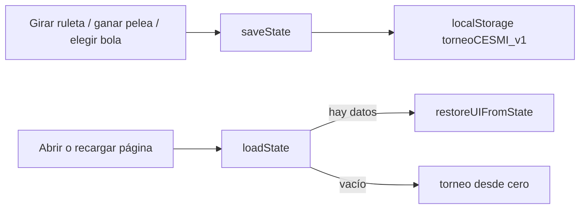

# 💾 Fase 1 — Persistencia local (localStorage)

> [!tldr] Resumen
> El torneo ya no se pierde al recargar. Todo el estado se autogarda en `localStorage` y se restaura al abrir la página. Reinicio con confirmación.

## 🎯 Problema

Todo el estado vivía en memoria:
- `tournamentPlayers` en `js/wheel.js:16`
- `currentStep` en `js/tree.js:1`
- Al recargar (F5) se perdía sorteo, llaves y campeón.

## ✅ Solución

Nueva capa de persistencia sin backend: `js/storage.js`.

### Clave y forma del dato

- Clave: `torneoCESMI_v1`
- Contenido (JSON):

```json
{
  "availablePlayers": ["..."],
  "tournamentPlayers": { "n0": "", "n1": "", "n2": "", "n3": "", "n4": "", "p1_win": "", "p2_win": "", "shikamaru_win": "", "champion": "" },
  "currentSlotIndex": 0,
  "currentStep": 1,
  "reward": { "name": "Master Ball", "file": "pokebolas/masterball.png" },
  "updatedAt": 1725763200000
}
```

### Funciones (`js/storage.js`)

| Función | Qué hace |
|---------|----------|
| `saveState()` | Lee las globales y escribe a `localStorage`. Actualiza `#saveStatus`. |
| `loadState()` | Lee y parsea, devuelve `null` si no hay nada o está corrupto. |
| `clearState()` | Borra la clave. |
| `restoreUIFromState(s)` | Restaura variables + nodos + versus + recompensa. |
| `updateSaveIndicator()` | Pinta `● Guardado automático HH:MM:SS` o `● Sin guardar`. |
| `restoreVersus()` | Repone el título y luchadores del versus según `currentStep`. |

## 🔧 Archivos modificados

### 1. `js/storage.js` (NUEVO)
Capa completa de persistencia. Expone todo en `window.*` para que `wheel/tree/rewards` lo usen sin imports (el proyecto no usa módulos).

### 2. `js/wheel.js`
- En `determineWinner()` → `window.saveState()` después de cada sorteo y después de asignar el último jugador (`n4`).
- Al final del archivo → bloque `initFromStorage()`: si hay `n0` o `champion` guardado, llama a `restoreUIFromState()`.

### 3. `js/tree.js`
- Al final de `selectWinner()` → `window.saveState()` (cubre los 4 pasos: P1, cruce impar, P2, final).

### 4. `js/rewards.js`
- Click en Pokébola → guarda en `window._selectedReward`, llama `saveState()`, delega el pintado a `showReward(reward, false)`.
- Nueva `showReward(reward, isRestore)` — usada también al restaurar.
- `restartBtn` ahora pide `confirm()` con el nombre del campeón y hace `clearState()` antes de `location.reload()`.
- Nueva `resetTournament()` global para el botón de la barra superior.

### 5. `index.html`
- Nuevo `<script src="js/storage.js">` **antes** de `wheel.js` (orden importante).
- Nueva barra en `view-draw`:
```html
<div class="save-bar">
  <span id="saveStatus">● Sin guardar</span>
  <button id="resetBtn" class="btn-reset" onclick="window.resetTournament()">↺ Reiniciar</button>
</div>
```

### 6. `css/styles.css`
- Estilos `.save-bar`, `#saveStatus` (verde), `.btn-reset`.

## 🔄 Flujo



## ⚠️ Limitaciones conocidas

> [!warning] Solo navegador local
> Cada navegador/PC tiene su propio `localStorage`. Si un jugador abre la página en su celu, ve un torneo vacío. Esto se resuelve en la [[Fase 2 - Supabase y modo espectador]].

- Si el `JSON` se corrompe, `loadState()` lo ignora y arranca de cero (no rompe la app).
- Los nombres por defecto siguen hardcodeados en `DEFAULT_PLAYERS` — pendiente: editor de jugadores.

## 🔗 Siguiente

- [[Fase 2 - Supabase y modo espectador]]
